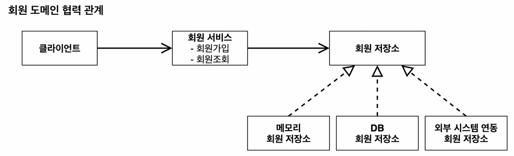
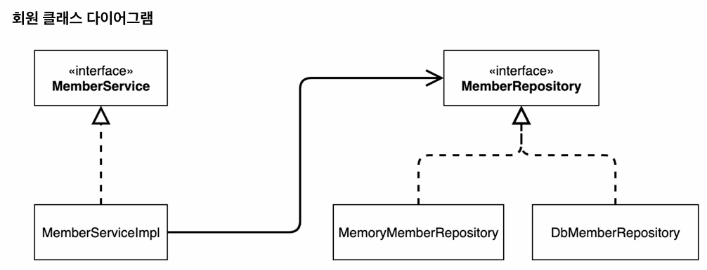

# 스프링 핵심 원리 - 기본편
#### 목차
1. 객체 지향 설계와 스프링
2. 스프링 핵심 원리 이해1 - 예제 만들기
3. 스프링 핵심 원리 이해2 - 객체 지향 원리 적용
4. 스프링 컨테이너와 스프링 빈
5. 싱글톤 컨테이너
6. 컴포넌트 스캔
7. 의존관계 자동 주입
8. 빈 생명주기 콜백
9. 빈 스코프

참고 강의 [인프런 - 스프링 핵심 원리](https://www.inflearn.com/course/%EC%8A%A4%ED%94%84%EB%A7%81-%ED%95%B5%EC%8B%AC-%EC%9B%90%EB%A6%AC-%EA%B8%B0%EB%B3%B8%ED%8E%B8)

## 스프링 핵심 원리 이해1 - 예제 만들기

### 회원 도메인 설계
- 회원
    - 회원을 가입하고 조회할 수 있다.
    - 회원은 일반과 VIP 두 가지 등급이 있다.
    - 회원 데이터는 자체 DB를 구축할 수 있고, 외부 시스템과 연동할 수 있다. (미확정)
  

### 주문과 할인 도메인 설계
- 주문과 할인 정책
    - 회원은 상품을 주문할 수 있다.
    - 회원 등급에 따라 할인 정책을 적용할 수 있다.
    - 할인 정책은 모든 VIP는 1000원을 할인해주는 고정 금액 할인을 적용해달라. (나중에 변경 될 수 있다.)
    - 할인 정책은 변경 가능성이 높다. 회사의 기본 할인 정책을 아직 정하지 못했고, 오픈 직전까지 고민을 미루고 싶다. 최악의 경우 할인을 적용하지 않을 수 도 있다. (미확정)