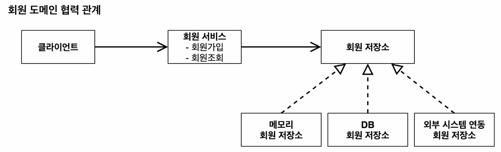
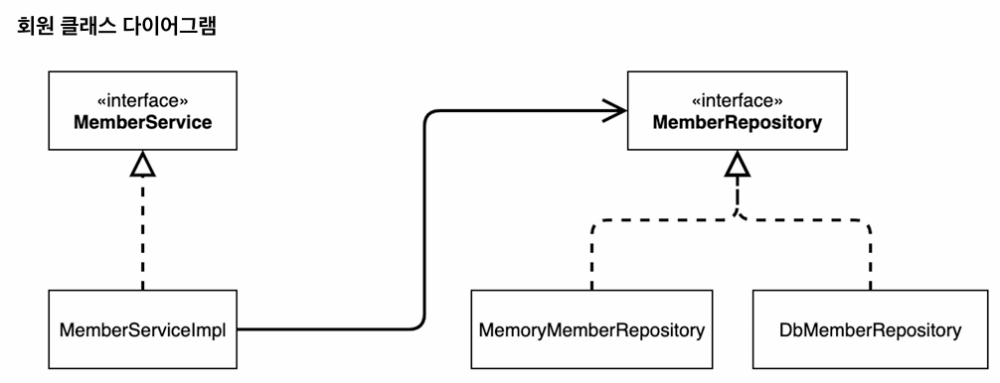

# 스프링 핵심 원리 - 기본편
#### 목차
1. 객체 지향 설계와 스프링
2. [스프링 핵심 원리 이해1 - 예제 만들기](#스프링-핵심-원리-이해1---예제-만들기)
3. [스프링 핵심 원리 이해2 - 객체 지향 원리 적용](#스프링-핵심-원리-이해2---객체-지향-원리-적용)
4. 스프링 컨테이너와 스프링 빈
5. 싱글톤 컨테이너
6. 컴포넌트 스캔
7. 의존관계 자동 주입
8. 빈 생명주기 콜백
9. 빈 스코프

참고 강의 [인프런 - 스프링 핵심 원리](https://www.inflearn.com/course/%EC%8A%A4%ED%94%84%EB%A7%81-%ED%95%B5%EC%8B%AC-%EC%9B%90%EB%A6%AC-%EA%B8%B0%EB%B3%B8%ED%8E%B8)

## 스프링 핵심 원리 이해1 - 예제 만들기

### 회원 도메인 설계
- 회원
    - 회원을 가입하고 조회할 수 있다.
    - 회원은 일반과 VIP 두 가지 등급이 있다.
    - 회원 데이터는 자체 DB를 구축할 수 있고, 외부 시스템과 연동할 수 있다. (미확정)
  



---

### 주문과 할인 도메인 설계
- 주문과 할인 정책
    - 회원은 상품을 주문할 수 있다.
    - 회원 등급에 따라 할인 정책을 적용할 수 있다.
    - 할인 정책은 모든 VIP는 1000원을 할인해주는 고정 금액 할인을 적용해달라. (나중에 변경 될 수 있다.)
    - 할인 정책은 변경 가능성이 높다. 회사의 기본 할인 정책을 아직 정하지 못했고, 오픈 직전까지 고민을 미루고 싶다. 최악의 경우 할인을 적용하지 않을 수 도 있다. (미확정)

<br>

#### 주문 도메인 협력, 역할, 책임


1. **주문 생성**: 클라이언트는 주문 서비스에 주문 생성을 요청한다.
2. **회원 조회**: 할인을 위해서는 회원 등급이 필요하다. 그래서 주문 서비스는 회원 저장소에서 회원을 조회한다.
3. **할인 적용**: 주문 서비스는 회원 등급에 따른 할인 여부를 할인 정책에 위임한다.
4. **주문 결과 반환**: 주문 서비스는 할인 결과를 포함한 주문 결과를 반환한다.

<br>

#### 주문 도메인 전체


=> **역할과 구현을 분리**해서 자유롭게 구현 객체를 조립할 수 있게 설계했다. 덕분에 회원 저장소는 물론이고, 할인 정책도 유연하게 변경할 수 있다

<br>

#### 주문 도메인 클래스 다이어그램


- 주문 서비스 구현체가 있으면,,
  - 회원을 메모리에서 조회하고, 정액 할인 정책을 지원해도 주문 서비스를 변경하지 않아도 된다. 역할들의 협력 관계를 그대로 재사용 할 수 있다.
  - 회원을 메모리가 아닌 실제 DB에서 조회하고, 정률 할인 정책을 지원해도 주문 서비스를 변경하지 않아도 된다!!


---

## 스프링 핵심 원리 이해2 - 객체 지향 원리 적용

### 새로운 할인 정책 개발
- 주문한 금액의 %를 할인해주는 새로운 정률 할인 정책 `RateDiscountPolicy` 추가
 


<br>

### 새로운 할인 정책 적용과 문제점
- 할인 정책 변경을 위해 `OrderServiceImpl` 코드 변경

```java
public class OrderServiceImpl implements OrderService {
	// private final DiscountPolicy discountPolicy = new FixDiscountPolicy();
	private final DiscountPolicy discountPolicy = new RateDiscountPolicy();
}
```


#### 문제점
- 우리는 역할과 구현을 분리했다. ✔️
- 다형성도 활용하고, 인터페이스와 구현 객체를 분리했다. ✔️
- OCP, DIP 같은 객체 지향 설계 원칙을 충실히 준수했다. ✖️
 - -> 그렇게 보이지만 사실은 아니다.
 - DIP : 주문서비스 클라이언트 `OrderServiceImpl` 는 `DiscountPolicy` 인터페이스에 의존하면서 DIP를 지킨 것 같아 보인다.
   - -> 클래스 의존관계를 분석해보자. 추상(인터페이스) 뿐만 아니라 **구체(구현) 클래스에도 의존**하고 있다.
   - 추상(인터페이스) 의존 : `DiscountPolicy`
   - 구체(구현) 클래스 : `FixDiscountPolicy`, `RateDiscountPolicy`
 - OCP : 변경하지 않고 확장할 수 있다고 했는데!
   - -> **지금 코드는 기능을 확장해서 변경하면, 클라이언트 코드에 영향을 준다!** 따라서 OCP를 위반한다. 

<br>

왜 클라이언트 코드를 변경해야 할까?

<br>

**기대했던 의존관계**


=> 지금까지 단순히 `DiscountPolicy` 인터페이스에만 의존한다고 생각했지만,,

<br>

**실제 의존관계**


- 잘보면 클라이언트인 `OrderServiceImpl`이 `DiscountPolicy`인터페이스 뿐만 아니라 `FixDiscountPolicy` 인 구체 클래스도 함께 의존하고 있다. 실제 코드를 보면 의존하고 있다! **DIP 위반**
- 그래서 `FixDiscountPolicy`를 `RateDiscountPolicy`로 변경하는 순간 `OrderServiceImpl`의 소스 코드도 함께 변경해야 한다. **OCP 위반**


### 문제 해결
- 클라이언트 코드인 `OrderServiceImpl`은 `DiscountPolicy`의 인터페이스 뿐만 아니라 구체 클래스도 함께 의존한다.
- 그래서 구체 클래스를 변경할때 클라이언트 코드도 함께 변경해야한다.
- DIP 위반 -> 추상에만 의존하도록 변경 (인터페이스에만 의존)
- DIP를 위반하지 않도록 인터페이스에만 의존하도록 의존관계를 변경하면 된다.

```java
public class OrderServiceImpl implements OrderService {
   // private final DiscountPolicy discountPolicy = new RateDiscountPolicy();
    private DiscountPolicy discountPolicy;
}
```

- 인터페이스에만 의존하도록 설계와 코드 변경
- 구현체가 없는데 어떻게 코드를 실행할 수 있는까?
- 실제 실행을 해보면 NPE(null pointer exception)가 발생한다.
- => 클라이언트인 `OrderServiceImpl`에 `DiscountPolicy`의 구현 객체를 대신 생성하고 주입해주어야 한다.

### 관심사의 분리
#### AppConfig 등장
- 애플리케이션의 전체 동작 방식을 구성하기 위해, **구현 객체를 생성**하고, **연결**하는 책임을 가지는 별도의 설정 클래스 만들기

```java
public class AppConfig {

  public MemberService memberService() {
     return new MemberServiceImpl(new MemoryMemberRepository());
  }

  public OrderService orderService() {
     return new OrderServiceImpl(new MemoryMemberRepository(),new FixDiscountPolicy());
  }
}
```

AppConfig는 애플리케이션의 실제 동작에 필요한 구현 객체를 생성함
- `MemberServiceImpl`
- `MemoryMemberRepository`
- `OrderServiceImpl`
- `FixDiscountPolicy`

AppConfig는 생성한 객체의 인스턴스 참조를 **생성자를 통해서 주입**해줌
- `MemberServiceImpl` -> `MemoryMemberRepository`
- `OrderServiceImpl` -> `MemoryMemberRepository`, `FixDiscountPolicy`
